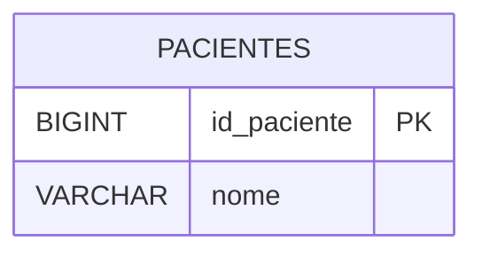
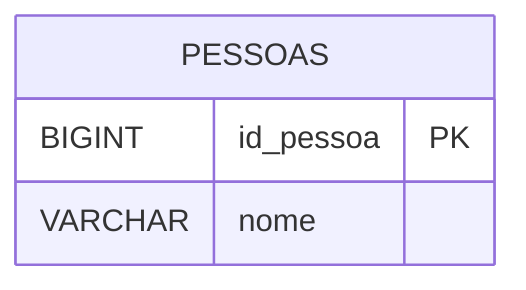

# Entrega — Aula 01 — Modelagem Conceitual (MER)

> Preencha as duas partes abaixo substituindo os blocos `erDiagram` de exemplo
> pelo seu modelo. Não apague os comentários `%%` dentro dos blocos — eles
> orientam o que é esperado — mas o conteúdo do diagrama em si é seu.
>
> Consulte o enunciado completo em
> [`documentacao/enunciado.md`](../documentacao/enunciado.md) antes de começar.
>
> **Nomenclatura:** siga as convenções já usadas na Aula 01 (PK no padrão
> `id_` + tabela no singular, FK no padrão tabela-referenciada-no-singular +
> `_id`) — mesmo sendo uma aula de modelagem conceitual pura, os exemplos de
> generalização da aula já usam essas convenções, então a correção automática
> também vai esperar por elas.

---

## Parte 1 — MER da Clínica Médica

> *"Uma clínica médica cadastra seus pacientes e médicos. Um médico pode ter
> várias especialidades. Os pacientes podem agendar consultas com os médicos.
> Cada consulta ocorre em uma data e horário específicos e gera um
> prontuário com o diagnóstico e a prescrição."*

Monte o MER completo abaixo. Seu diagrama precisa conter, no mínimo:
`PACIENTES`, `MEDICOS`, `ESPECIALIDADES`, `CONSULTAS` e `PRONTUARIOS`,
com as chaves primárias/estrangeiras corretas e as cardinalidades certas
entre elas (pense com cuidado no relacionamento Médico×Especialidade, e no
que liga uma Consulta ao seu Prontuário).

---

## Parte 2 — Generalização de Pessoas (Aluno / Professor / Funcionário Administrativo)

> Entidades: **Aluno**, **Professor** e **Funcionário Administrativo** — todos
> de uma faculdade. Proponha uma superclasse que reúna o que é comum às três,
> mantendo em cada subclasse apenas os atributos exclusivos dela.
>
> **Para a correção automática, use exatamente estes nomes de entidade:**
> `PESSOAS` (superclasse), `ALUNOS`, `PROFESSORES`,
> `FUNCIONARIOS_ADMINISTRATIVOS`. Siga a **Estratégia 2** descrita na Seção
> 8.7 da aula: cada subclasse tem sua PK própria, que também é FK única para
> a superclasse (mesmo valor, mesmo `id_pessoa`).

### Restrição da hierarquia

> Preencha os três campos abaixo. Não existe uma única resposta "certa"
> automaticamente verificável aqui — o que a correção automática confere é
> se você **tomou uma decisão explícita e a justificou**; a adequação da
> escolha ao enunciado é avaliada pelo professor.

- **Obrigatoriedade:** <!-- Total ou Parcial -->
- **Exclusividade:** <!-- Exclusiva ou Sobreposta -->
- **Justificativa:** <!-- explique em 2-4 frases, pensando em casos reais (ex.: uma pessoa pode ser aluno e funcionário administrativo ao mesmo tempo?) -->
