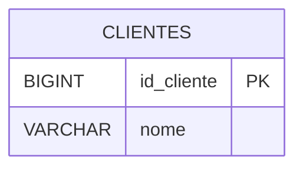
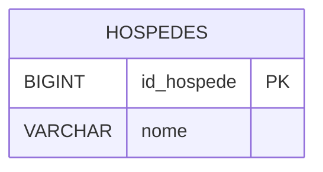

# Entrega — Aula 02 — Normalização e Modelo Lógico

> Preencha as duas partes abaixo substituindo os blocos `erDiagram` de
> exemplo e os campos de texto pelo seu conteúdo. Não apague os comentários
> `%%` dentro dos blocos — eles orientam o que é esperado — mas o conteúdo
> do diagrama em si é seu.
>
> Consulte o enunciado completo em
> [`documentacao/enunciado.md`](../documentacao/enunciado.md) antes de
> começar.
>
> **Nomenclatura:** toda PK segue `id_` + tabela no singular (Regra 5) e
> toda FK segue tabela-referenciada-no-singular + `_id` (Regra 6) — a
> correção automática espera exatamente esses nomes.

---

## Parte 1 — Normalização até a 3FN — Oficina Mecânica

### a) Mapeamento de dependências funcionais

> Mapeie as dependências da tabela desnormalizada em relação à chave
> composta `(id_ordem, cod_servico)`, seguindo o formato das Seções 4.2/5.2
> da aula (`X → Y`, indicando total/parcial/transitiva). Não esqueça das
> dependências transitivas "escondidas" dentro das parciais (veja o
> enunciado).

<!--
Escreva aqui seu mapeamento de dependências. Exemplo do formato esperado
(não copie o conteúdo, só o formato):

(id_ordem, cod_servico) → quantidade    ✅ Depende da chave inteira
id_ordem                → data_servico  ⚠️  Dependência PARCIAL
...
-->

### b) Modelo lógico final (3FN)

> Sua entrega precisa conter, no mínimo, as tabelas `CLIENTES`, `VEICULOS`,
> `MECANICOS`, `SERVICOS`, `ORDENS_SERVICO` e `ITENS_ORDEM_SERVICO`, com
> PKs/FKs corretas e cardinalidades corretas entre elas.

---

## Parte 2 — Passagem ao Modelo Lógico — Rede de Hotéis

> Aplique as regras da Seção 8 da aula aos quatro relacionamentos descritos
> no enunciado (1:N, N:M com atributo, 1:1 e entidade fraca). Sua entrega
> precisa conter, no mínimo, as tabelas `HOSPEDES`, `RESERVAS`, `QUARTOS`,
> `RESERVAS_QUARTOS`, `CARTOES_FIDELIDADE` e `DIARIAS`.

### Justificativa — FK do relacionamento 1:1

> Em qual tabela você colocou a FK do relacionamento Hóspedes ×
> Cartões_Fidelidade, e por quê? Releia o Critério 1 (participação) e o
> Critério 2 (semântica) da Seção 8.1 antes de responder.

- **Justificativa:** <!-- explique em 2-4 frases -->
